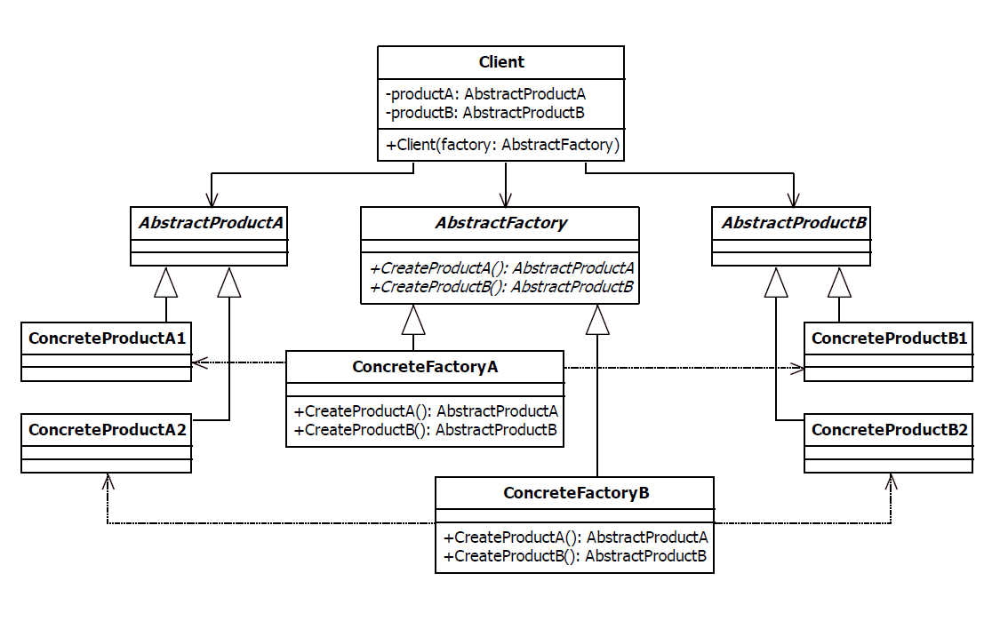

# Abstract Factory Design Pattern

| Name             | Type       | A.K.A.                |
|------------------|------------|-----------------------|
| Abstract Factory | Structural | <ul><li>Kit</li></ul> |

## Explanation

> The abstract factory pattern is used to provide a client with a set of related or dependant objects. The "family" of objects created by the factory are determined at run-time.

### Intent

> Provide an interface for creating families of related or dependent objects without specifying their concrete classes.

### Wikipedia

> The abstract factory pattern provides a way to encapsulate a group of individual factories that have a common theme without specifying their concrete classes. In normal usage, the client software creates a concrete implementation of the abstract factory and then uses the generic interface of the factory to create the concrete objects that are part of the theme. The client does not know (or care) which concrete objects it gets from each of these internal factories, since it uses only the generic interfaces of their products.

## Implementation



### Example

```kotlin
interface Button {
    fun render()
}

class WindowsButton : Button {
    override fun render() {
        println("Windows button render")
    }
}

class LinuxButton : Button {
    override fun render() {
        println("Linux button render")
    }
}
```

```kotlin
interface Label {
    fun draw()
}

class WindowsLabel : Label {
    override fun draw() {
        println("Windows label draw")
    }
}

class LinuxLabel : Label {
    override fun draw() {
        println("Linux label draw")
    }
}
```

```kotlin
interface GUIComponentFactory {

    fun createButton(): Button

    fun createPanel(): Label

}
```

```kotlin
object GUIComponentFactoryProvider {

    fun getGUIComponentFactory(): GUIComponentFactory {
        return if (System.getProperty("os.name").lowercase().contains("windows")) WindowsComponentFactory()
        else LinuxComponentFactory()
    }

}
```

Main function

```kotlin
fun main() {

    val componentFactory = GUIComponentFactoryProvider.getGUIComponentFactory()
    val button = componentFactory.createButton()
    button.render()
    val label = componentFactory.createPanel()
    label.draw()

}
```

Program output

```
Windows button render
Windows label draw
```

## Applicability

Use the Abstract Factory pattern when

* a system should be independent o f how its products are created, composed, and represented.
* a system should be configured with one of multiple families of products.
* a family of related product objects is designed to be used together, and you need to enforce th is constraint.
* you want to provide a class library of products, and you want to reveal just their interfaces, not their
  implementations.

### Known Uses

- javax.xml.parsers.DocumentBuilderFactory
- javax.xml.transform.TransformerFactory
- javax.xml.xpath.XPathFactory
