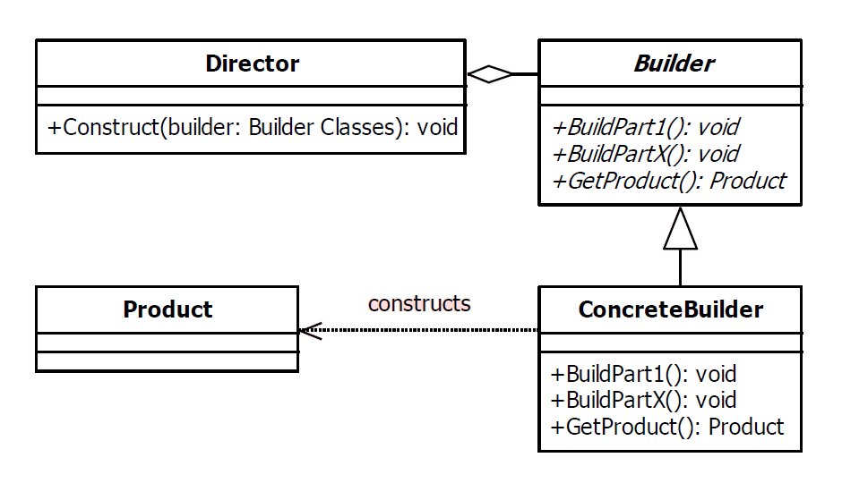

# Builder Design Pattern

| Name    | Type       |
|---------|------------|
| Builder | Creational |

## Explanation

> The builder pattern is used to create complex objects with constituent parts that must be created in the same order or using a specific algorithm. An external class controls the construction algorithm.

### Intent

> Separate the construction of a complex object from its representation so that the same construction process can create different representations.

### Wikipedia

> The builder pattern is a design pattern designed to provide a flexible solution to various object creation problems in object-oriented programming. The intent of the Builder design pattern is to separate the construction of a complex object from its representation.

## Implementation



### Example

```kotlin
class Book private constructor(
    val isbn: String,
    val title: String?,
    val author: String?,
    val page: Int
) {

    override fun toString(): String = "Book(isbn=$isbn, title=$title, author=$author, page=$page)"

    data class Builder(
        val isbn: String,
        var title: String? = null,
        var author: String? = null,
        var page: Int = 0
    ) {
        fun title(title: String) = apply { this.title = title }
        fun author(author: String) = apply { this.author = author }
        fun page(page: Int) = apply { this.page = page }
        fun build() = Book(isbn, title, author, page)
    }

}
```

Main Function

```kotlin
fun main() {
    val book = Book.Builder("9781400052998")
        .title("The Metamorphosis")
        .author("Franz Kafka")
        .page(102)
        .build()
    println(book)
}
```

Program Output

```kotlin
Book(isbn = 9781400052998, title = The Metamorphosis, author = Franz Kafka, page = 102)
```

## Applicability

Use the Builder pattern when

* the algorithm for creating a complex object should be independent of the parts that make up the object and how they're
  assembled.
* the construction process must allow different representations for the object that's constructed.

### Known Uses

- java.lang.StringBuilder
- java.lang.StringBuffer
- Buffers under java.nio package
- java.lang.Appendable implementations
