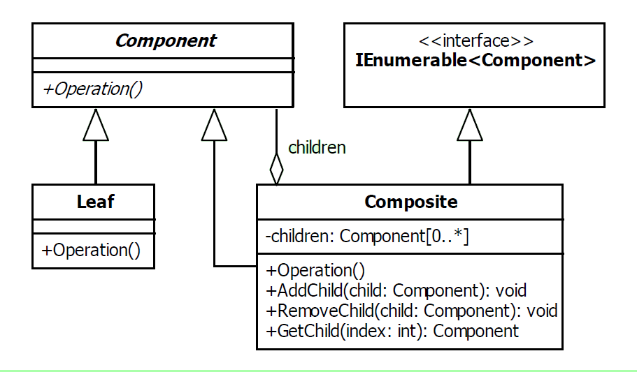

# Composite Design Pattern

|Name|Type|
|---|---|
|Composite|Structural|

## Explanation

> The composite pattern is used to create hierarchical, recursive tree structures of related objects where any element of
> the structure may be accessed and utilised in a standard manner.

### Intent

> Compose objects into tree structures to represent part-whole hierarchies. Composite lets clients treat individual
> objects and compositions of objects uniformly.

### Wikipedia

> In software engineering, the composite pattern is a partitioning design pattern. The composite pattern describes a group
> of objects that are treated the same way as a single instance of the same type of object. The intent of a composite is
> to "compose" objects into tree structures to represent part-whole hierarchies. Implementing the composite pattern lets
> clients treat individual objects and compositions uniformly.

## Implementation



### Example

```kotlin
interface Effect {

    fun getName(): String

    fun getValue(value: Int): Int

}

class AdditionEffect(private val name: String, private val addition: Int) : Effect {

    override fun getName(): String = name

    override fun getValue(value: Int): Int {
        return value + addition
    }

}

class PercentageEffect(private val name: String, val percentage: Float, val add: Boolean) : Effect {

    init {
        if (percentage < 0 && percentage > 1.0f)
            throw IllegalArgumentException()
    }

    override fun getName(): String = name

    override fun getValue(value: Int): Int {
        if (add)
            return value + ((value * percentage).toInt())
        return value - ((value * percentage).toInt())
    }

}

class CompositeEffect : Effect {

    val effects: MutableList<Effect> = mutableListOf()

    fun addEffect(effect: Effect) {
        effects.add(effect)
    }

    override fun getName(): String {
        var allName = ""
        effects.forEach { allName += " ${it.getName()}" }
        return allName
    }

    override fun getValue(value: Int): Int {
        var allValue = value
        effects.forEach { allValue += it.getValue(allValue) }
        return allValue
    }

}

```

```kotlin
class Hero(var damage: Int, var speed: Int) {

    fun applyDamageEffect(effect: Effect) {
        val value = effect.getValue(damage)
        println("Applying damage effect, name: ${effect.getName()}, value: $value")
        damage += value
    }

    fun applySpeedEffect(effect: Effect) {
        val value = effect.getValue(speed)
        println("Applying speed effect, name: ${effect.getName()}, value: $value")
        speed += value
    }

    override fun toString(): String = "Hero(damage=$damage, speed=$speed)"

}
```

Main Function

```kotlin
fun main() {

    val hero = Hero(100, 75)
    println(hero)
    val grimEffect = AdditionEffect("Grim", 70)
    hero.applyDamageEffect(grimEffect)
    println(hero)
    val cruelEffect = PercentageEffect("Cruel", 0.25f, true)
    val compositeEffect = CompositeEffect()
    compositeEffect.addEffect(cruelEffect)
    compositeEffect.addEffect(grimEffect)
    hero.applyDamageEffect(compositeEffect)
    println(hero)

}

```

Program Output

```kotlin
Hero(damage = 100, speed = 75)
Applying damage effect, name: Grim, value: 170
Hero(damage = 270, speed = 75)
Applying damage effect, name:  Cruel Grim, value: 1284
Hero(damage = 1554, speed = 75)
```

## Applicability

Use the Composite pattern when

* You want to represent part-whole hierarchies of objects.
* You want clients to be able to ignore the difference between compositions of objects and individual objects. Clients
  will treat all objects in the composite structure uniformly.

### Known Uses

- java.awt.Container
- java.awt.Component
