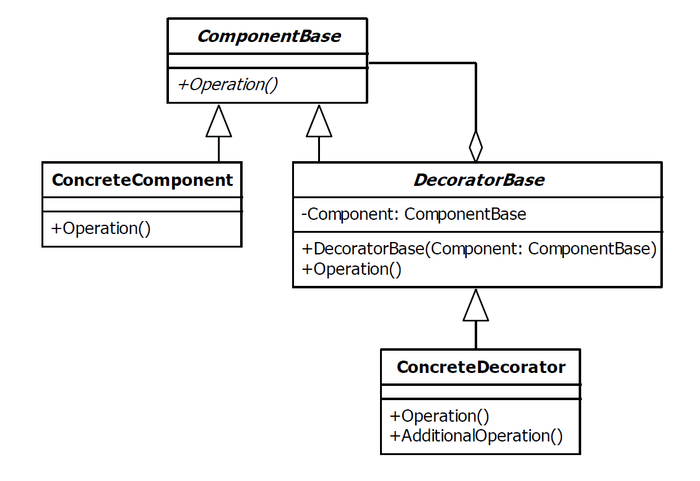

# Decorator Design Pattern

|Name|Type|A.K.A.|
|---|---|---|
|Decorator|Structural|<ul><li>Wrapper</li></ul>|

## Explanation

> The decorator pattern is used to extend or alter the functionality of objects at runtime by wrapping them in an object
> of a decorator class. This provides a flexible alternative to using inheritance to modify behaviour.

### Intent

> Attach additional responsibilities to an object dynamically. Decorators provide a flexible alternative to subclassing
> for extending functionality.

### Wikipedia

> In object-oriented programming, the decorator pattern is a design pattern that allows behavior to be added to an
> individual object, dynamically, without affecting the behavior of other objects from the same class. The decorator
> pattern is often useful for adhering to the Single Responsibility Principle, as it allows functionality to be divided
> between classes with unique areas of concern

## Implementation



### Example

```kotlin
interface Shape {
    fun draw()
}

class Circle : Shape {
    override fun draw() {
        println("Drawing circle")
    }
}
```

```kotlin
open class ShapeDecorator(protected val shape: Shape) : Shape {

    override fun draw() {
        shape.draw()
    }

}
```

```kotlin
class ColoredShape(val color: String, shape: Shape) : ShapeDecorator(shape) {

    override fun draw() {
        super.draw()
        fillColor()
    }

    fun fillColor() {
        println("Shape filled by '$color' color")
    }

}
```

Main Function

```kotlin
fun main() {
    val circle = Circle()
    circle.draw()
    val blueCircle = ColoredShape("blue", circle)
    blueCircle.draw()
}
```

Program Output

```
Drawing circle
Drawing circle
Shape filled by 'blue' color
```

## Applicability

Decorator is used to:

* Add responsibilities to individual objects dynamically and transparently, that is, without affecting other objects.
* For responsibilities that can be withdrawn.
* When extension by subclassing is impractical. Sometimes a large number of independent extensions are possible and
  would produce an explosion of subclasses to support every combination. Or a class definition may be hidden or
  otherwise unavailable for subclassing.
  
### Known Uses

- java.util.Collections#synchronizedXXX()
- java.util.Collections#unmodifiableXXX()
- java.util.Collections#checkedXXX()
