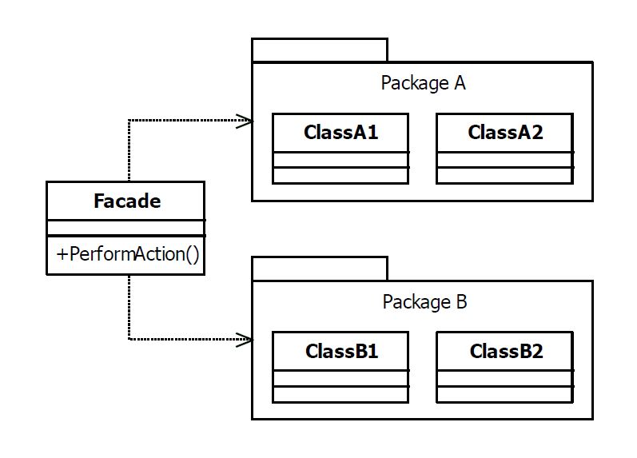

# Facade Design Pattern

|Name|Type|
|---|---|
|Facade|Structural|

## Explanation

> The facade pattern is used to define a simplified interface to a more complex subsystem.

### Intent

> Provide a unified interface to a set of interfaces in a subsystem. Facade defines a higher-level interface that makes
> the subsystem easier to use.

### Wikipedia

> facade pattern is a software-design pattern commonly used in object-oriented programming. Analogous to a facade in
> architecture, a facade is an object that serves as a front-facing interface masking more complex underlying or
> structural code.

## Implementation



### Example

```kotlin
class NetworkConnection {

    fun connect(ip: String): Connection {
        println("Connection to $ip")
        return Connection(ip)
    }

    class Connection(private val ip: String) {
        fun send(data: ByteArray) {
            println("Data is sending")
        }
        fun disconnect() {
            println("Disconnecting")
        }
    }

}
```

```kotlin
class HostnameResolver {

    fun fetchIpAddress(hostname: String): String {
        println("Fetching ip address")
        return "127.0.0.1"
    }

}
```

```kotlin
class DataEncoder {

    private val encoder: Base64.Encoder = Base64.getEncoder()

    fun encode(data: ByteArray): ByteArray {
        println("Data is encoding")
        return encoder.encode(data)
    }

}
```

```kotlin
class DataTransmissionFacade {

    private val hostnameResolver = HostnameResolver()
    private val dataEncoder = DataEncoder()
    private val networkConnection = NetworkConnection()

    fun sendData(hostname: String, data: ByteArray) {
        val ip = hostnameResolver.fetchIpAddress(hostname)
        val encodedData = dataEncoder.encode(data)
        val connection = networkConnection.connect(ip)
        connection.send(encodedData)
        connection.disconnect()
    }

}

```

Main Function

```kotlin
fun main() {
    val dataTransmissionFacade = DataTransmissionFacade()
    dataTransmissionFacade.sendData("localhost", ByteArray(64))
}
```

Program Output

```
Fetching ip address
Data is encoding
Connection to 127.0.0.1
Data is sending
Disconnecting
```

## Applicability

Use the Facade pattern when

* You want to provide a simple interface to a complex subsystem. Subsystems often get more complex as they evolve. Most
  patterns, when applied, result in more and smaller classes. This makes the subsystem more reusable and easier to
  customize, but it also becomes harder to use for clients that don't need to customize it. A facade can provide a
  simple default view of the subsystem that is good enough for most clients. Only clients needing more customization
  will need to look beyond the facade.
* There are many dependencies between clients and the implementation classes of an abstraction. Introduce a facade to
  decouple the subsystem from clients and other subsystems, thereby promoting subsystem independence and portability.
* You want to layer your subsystems. Use a facade to define an entry point to each subsystem level. If subsystems are
  dependent, then you can simplify the dependencies between them by making them communicate with each other solely
  through their facades.

### Knwon Uses

- [SLF4J](https://github.com/qos-ch/slf4j)