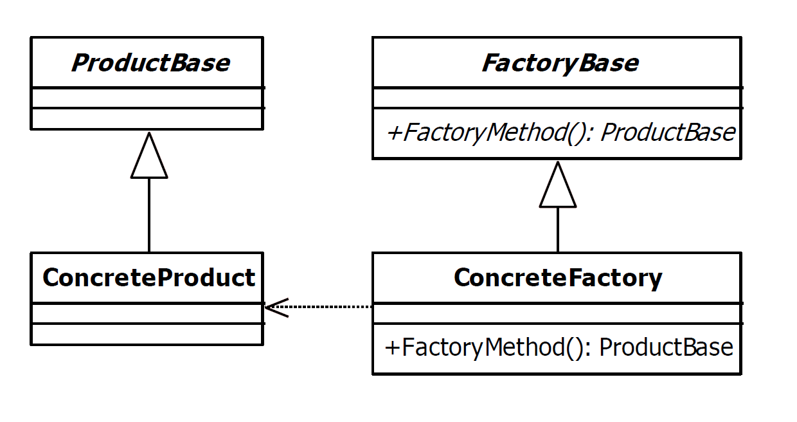

# Factory Method Design Pattern

| Name           | Type       | A.K.A.                                |
|----------------|------------|---------------------------------------|
| Factory Method | Creational | <ul><li>Virtual Constructor</li></ul> |

## Explanation

> The factory pattern is used to replace class constructors, abstracting the process of object generation so that the type of the object instantiated can be determined at run-time.

### Intent

> Define an interface for creating an object, but let subclasses decide which class to instantiate. Factory Method lets a class defer instantiation to subclasses.

### Wikipedia

> In class-based programming, the factory method pattern is a creational pattern that uses factory methods to deal with the problem of creating objects without having to specify the exact class of the object that will be created. This is done by creating objects by calling a factory method—either specified in an interface and implemented by child classes, or implemented in a base class and optionally overridden by derived classes—rather than by calling a constructor.

## Implementation



### Example

```kotlin
interface Weapon {
    fun getWeaponBlueprint(): Blueprint
}

class CorpusWeapon(private val blueprint: Blueprint) : Weapon {
    override fun getWeaponBlueprint() = blueprint
    override fun toString() = "Corpus $blueprint"
}

class GrineerWeapon(private val blueprint: Blueprint) : Weapon {
    override fun getWeaponBlueprint() = blueprint
    override fun toString() = "Grineer $blueprint"
}
```

```kotlin
enum class Blueprint {
    RIFLE,
    PISTOL,
    KNIFE
}
```

```kotlin
interface Foundry {
    fun manufactureWeapon(blueprint: Blueprint): Weapon
}

class CorpusFoundry : Foundry {
    override fun manufactureWeapon(blueprint: Blueprint) = CorpusWeapon(blueprint)
    override fun toString() = "Corpus foundry"
}

class GrineerFoundry : Foundry {
    override fun manufactureWeapon(blueprint: Blueprint) = GrineerWeapon(blueprint)
    override fun toString() = "Grineer foundry"
}
```

Main Function

```kotlin
fun main() {
    var foundry: Foundry = CorpusFoundry()
    println(foundry)
    var weapon = foundry.manufactureWeapon(Blueprint.RIFLE)
    println(weapon)
    foundry = GrineerFoundry()
    println(foundry)
    weapon = foundry.manufactureWeapon(Blueprint.PISTOL)
    println(weapon)
}
```

Program Output

```
Corpus foundry
Corpus RIFLE
Grineer foundry
Grineer PISTOL
```

## Applicability

Use the Factory Method pattern when

* a class can't anticipate the class of objects it must create.
* a class wants its subclasses to specify the objects it creates.
* classes delegate responsibility to one of several helper subclasses, and you want to localize the knowledge of which
  helper subclass is the delegate.

### Known Uses
