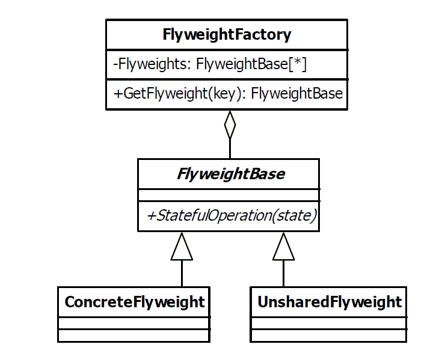

# Flyweight Design Pattern

| Name      | Type       |
|-----------|------------|
| Flyweight | Structural |

## Explanation

> The flyweight pattern is used to reduce the memory and resource usage for complex models containing many hundreds, thousands or hundreds of thousands of similar objects.

### Intent

> Use sharing to support large numbers of fine-grained objects efficiently.

### Wikipedia

> In computer programming, flyweight is a software design pattern. A flyweight is an object that minimizes memory use by sharing as much data as possible with other similar objects; it is a way to use objects in large numbers when a simple repeated representation would use an unacceptable amount of memory.

## Implementation



### Example

```kotlin
data class BalloonType(val name: String, val color: Color) {
    init {
        println("New balloon type initialized, name:$name")
    }
}

```

```kotlin
class Balloon(val type: BalloonType, val x: Int, val y: Int) {

    fun draw() {
        println("Balloon, name: ${type.name}, colorRGB: ${type.color.rgb}, position: $x,$y")
    }

}
```

```kotlin
object BalloonFactory {

    private val typeMap: HashMap<String, BalloonType> = HashMap<String, BalloonType>()

    fun getBalloonType(name: String, color: Color): BalloonType {
        if (typeMap.contains(name))
            return typeMap[name]!!
        val balloonType = BalloonType(name, color)
        typeMap[name] = balloonType
        return balloonType
    }

}
```

Main Function

```kotlin
fun main() {
    for (i in 1..2) {
        val balloonType = BalloonFactory.getBalloonType("blue", Color.BLUE)
        val balloon = Balloon(balloonType, i, i)
        balloon.draw()
    }
    for (i in 1..2) {
        val balloonType = BalloonFactory.getBalloonType("green", Color.GREEN)
        val balloon = Balloon(balloonType, i, i)
        balloon.draw()
    }
}
```

Program Output

```
New balloon type initialized, name:blue
Balloon, name: blue, colorRGB: -16776961, position: 1,1
Balloon, name: blue, colorRGB: -16776961, position: 2,2
New balloon type initialized, name:green
Balloon, name: green, colorRGB: -16711936, position: 1,1
Balloon, name: green, colorRGB: -16711936, position: 2,2
```

## Applicability

The Flyweight pattern's effectiveness depends heavily on how and where it's used. Apply the Flyweight pattern when all
of the following are true:

* An application uses a large number of objects.
* Storage costs are high because of the sheer quantity of objects.
* Most of the object state can be made extrinsic.
* Many groups of objects may be replaced by relatively few shared objects once the extrinsic state is removed.
* The application doesn't depend on object identity. Since flyweight objects may be shared, identity tests will return
  true for conceptually distinct objects.

### Knwon Uses

- java.lang primitive wrapper classes #valueOf()