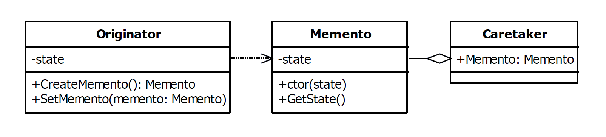

# Memento Design Pattern

|Name|Type|A.K.A.|
|---|---|---|
|Memento|Behavioral|<ul><li>Token</li></ul>|

## Explanation

> The memento pattern is used to capture the current state of an object and store it in such a manner that it can be
> restored at a later time without breaking the rules of encapsulation.

### Intent

> Without violating encapsulation, capture and externalize an object's internal state so that the object can be restored
> to this state later.

### Wikipedia

> The memento pattern is a software design pattern that provides the ability to restore an object to its previous state (
undo > via rollback).

## Implementation



### Example

```kotlin
interface FileMemento
```

```kotlin
class TextFile(var name: String) {

    var text: String = ""
    var lastUpdateTime: Long = System.currentTimeMillis()

    fun rename(name: String) {
        this.name = name;
        this.lastUpdateTime = System.currentTimeMillis()
    }

    fun clear() {
        text = "";
        this.lastUpdateTime = System.currentTimeMillis()
    }

    fun append(text: String) {
        this.text += text
        this.lastUpdateTime = System.currentTimeMillis()
    }

    fun getMemento(): FileMemento = TextFileMemento(name, lastUpdateTime, text)

    fun createMemento(fileMemento: FileMemento) {
        var textFileMemento = fileMemento as TextFileMemento
        this.name = textFileMemento.name
        this.lastUpdateTime = textFileMemento.lastUpdateTime
        this.text = textFileMemento.text
    }

    fun printFile() {
        println("TextFile, name: $name, updatedAt: $lastUpdateTime text: $text")
    }

    data class TextFileMemento(val name: String, val lastUpdateTime: Long, val text: String) : FileMemento

}
```

Main Function

```kotlin
fun main() {
    val stack = Stack<FileMemento>()
    val textFile = TextFile("Numbers")
    textFile.append("1,2,3")
    stack.push(textFile.getMemento())
    textFile.printFile()
    textFile.append(",4,5,6")
    stack.push(textFile.getMemento())
    textFile.printFile()
    textFile.append(",7,8,9")
    textFile.printFile()
    textFile.createMemento(stack.pop())
    println("Loading prerecorded memento")
    textFile.printFile()
    textFile.createMemento(stack.pop())
    println("Loading prerecorded memento")
    textFile.printFile()
}
```

Program Output

```
TextFile, name: Numbers, updatedAt: 1632467734090 text: 1,2,3
TextFile, name: Numbers, updatedAt: 1632467734091 text: 1,2,3,4,5,6
TextFile, name: Numbers, updatedAt: 1632467734091 text: 1,2,3,4,5,6,7,8,9
Loading pre saved memento
TextFile, name: Numbers, updatedAt: 1632467734091 text: 1,2,3,4,5,6
Loading pre saved memento
TextFile, name: Numbers, updatedAt: 1632467734090 text: 1,2,3
```

## Applicability

Use the Memento pattern when

* A snapshot of an object's state must be saved so that it can be restored to that state later, and
* A direct interface to obtaining the state would expose implementation details and break the object's encapsulation

### Known uses

- java.util.Date