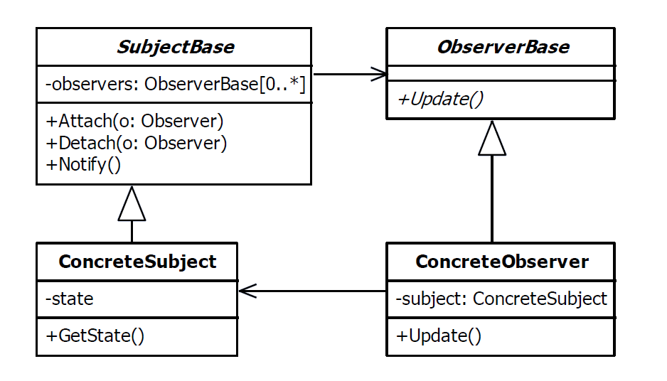

# Observer Design Pattern

| Name     | Type       | A.K.A.                                                 |
|----------|------------|--------------------------------------------------------|
| Observer | Behavioral | <ul><li>Dependents</li><li>Publish-Subscribe</li></ul> |

## Explanation

> The observer pattern is used to allow an object to publish changes to its state. Other objects subscribe to be immediately notified of any changes.

### Intent

> Define a one-to-many dependency between objects so that when one object changes state, all its dependents are notified and updated automatically.

### Wikipedia

> The observer pattern is a software design pattern in which an object, named the subject, maintains a list of its dependents, called observers, and notifies them automatically of any state changes, usually by calling one of their methods.

## Implementation



### Example

Item is an observable class and any PriceObserver instances can be register in Item object to be notified whenever any
price changes.

Item class can register and unregister PriceObserver type.

```kotlin
class Item(val name: String, var price: Float) {

    val observerList: MutableList<PriceObserver> = mutableListOf<PriceObserver>()

    fun addObserver(priceObserver: PriceObserver) {
        this.observerList.add(priceObserver)
    }

    fun removeObserver(priceObserver: PriceObserver) {
        this.observerList.remove(priceObserver)
    }

    fun updatePrice(discount: Discount) {
        price *= (1f - discount.percentage)
        observerList.forEach { it.update(discount, this) }
    }

}
```

Discount class is used to make any changes on item price

```kotlin
class Discount(val percentage: Float, val hour: UInt)
```

```kotlin
interface PriceObserver {

    fun update(discount: Discount, item: Item)

}

class UpdateDiscountedItemListObserver(val discountedItemList: MutableList<Item>) : PriceObserver {

    override fun update(discount: Discount, item: Item) {
        if (!discountedItemList.contains(item)) {
            discountedItemList.add(item)
            println("Item ${item.name} is added to discounted list")
        }
    }

}

class SendNotificationObserver(private val threshold: Float) : PriceObserver {

    override fun update(discount: Discount, item: Item) {
        if (threshold <= discount.percentage)
            println("Notification: ${item.name} is now ${item.price}\$, ${discount.percentage * 100}% discount for ${discount.hour} hour")
        else
            println("Notification: ${item.name} is now ${item.price}\$")
    }

}
```

Main Function

```kotlin
fun main() {
    val discountedItemList: MutableList<Item> = mutableListOf()
    val item = Item("Knife", 10f)
    item.addObserver(UpdateDiscountedItemListObserver(discountedItemList))
    item.addObserver(SendNotificationObserver(0.2f))
    item.updatePrice(Discount(0.10f, 2u))
    item.updatePrice(Discount(0.50f, 5u))
    item.updatePrice(Discount(0.25f, 4u))
}
```

Program Output

```
Item Knife is added to discounted list
Notification: Knife is now 9.0
Notification: Knife is now 4.5$, 50.0% discount for 4 hour
Notification: Knife is now 3.375$, 25.0% discount for 5 hour
```

## Applicability

Use the Observer pattern in any of the following situations:

* When an abstraction has two aspects, on e dependent o n the other. Encapsulating these aspects in separate objects
  lets you vary and reuse them independently.
* When a change to one object requires changing others, and you don't know how many objects need to be changed.
* When an object should be able to notify other objects without making assumptions about who these objects are. In other
  words, you don't want these objects tightly coupled.

### Known Uses

- java.util.Observer
- java.util.EventListener
- [RxJava](https://github.com/ReactiveX/RxJava)
- [Reactor](https://github.com/reactor/reactor)
