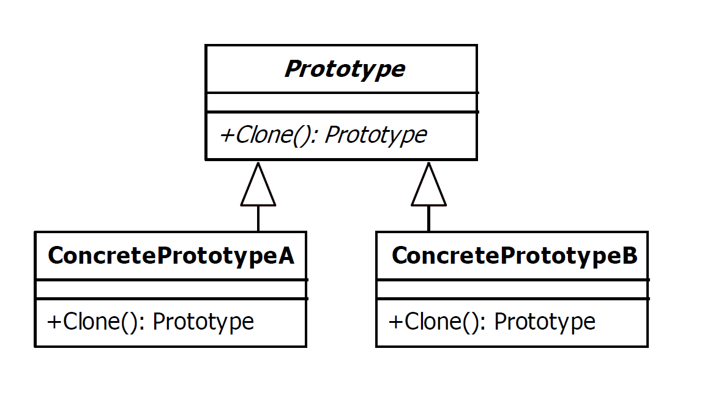

# Prototype Design Pattern

|Name|Type|
|---|---|
|Prototype|Creational|

## Explanation

> The prototype pattern is used to instantiate a new object by copying all of the properties of an existing object,
> creating an independent clone. This practise is particularly useful when the construction of a new object is
> inefficient.

### Intent

> Specify the kinds of objects to create using a prototypical instance, and create new objects by copying this prototype.

### Wikipedia

> The prototype pattern is a creational design pattern in software development. It is used when the type of objects to
> create is determined by a prototypical instance, which is cloned to produce new objects.

## Implementation



### Example

```kotlin
abstract class Building(var x: Int, var y: Int, var color: String) {

    constructor(building: Building) : this(building.x, building.y, building.color)

    abstract fun clone(): Building

    override fun toString(): String = "x: $x, y: $y, color: $color"

}

class Castle(x: Int, y: Int, color: String, var height: Float) : Building(x, y, color) {

    constructor(tower: Castle) : this(tower.x, tower.y, tower.color, tower.height)

    override fun clone(): Castle = Castle(this)

    override fun toString(): String = "Castle: " + super.toString() + " height: $height"

}

class Tower(x: Int, y: Int, color: String, var capacity: Int) : Building(x, y, color) {

    constructor(tower: Tower) : this(tower.x, tower.y, tower.color, tower.capacity)

    override fun clone(): Tower = Tower(this)

    override fun toString(): String = "Tower: " + super.toString() + " capacity: $capacity"

}
```

Main Function

```kotlin
fun main(args: Array<String>) {
    var castle = Castle(250, 170, "blue", 197.5f)
    println(castle)
    var anotherCastle = castle.clone()
    anotherCastle.x = 210
    anotherCastle.color = "green"
    println(anotherCastle)
    var tower = Tower(130, 510, "black", 100)
    println(tower)
    var anotherTower = tower.clone()
    anotherCastle.x = 270
    anotherTower.capacity = 150
    println(anotherTower)
}
```

Program Output

```
Castle: x: 250, y: 170, color: blue height: 197.5
Castle: x: 210, y: 170, color: green height: 197.5
Tower: x: 130, y: 510, color: black capacity: 100
Tower: x: 130, y: 510, color: black capacity: 150
```

## Applicability

Use the Prototype pattern when a system should be independent of how its products are created, composed, and
represented; and

* when the classes to instantiate are specified at run-time, for example, by dynamic loading ; or
* to avoid building a class hierarchy of factories that parallels the class hierarchy of products; or
* when instances of a class can have one of only a few different combinations of state. It may be more convenient to
  install a corresponding number of prototypes and clone them rather than instantiating the class manually, each time
  with the appropriate state.

### Known Uses

- java.lang.Object#clone()
