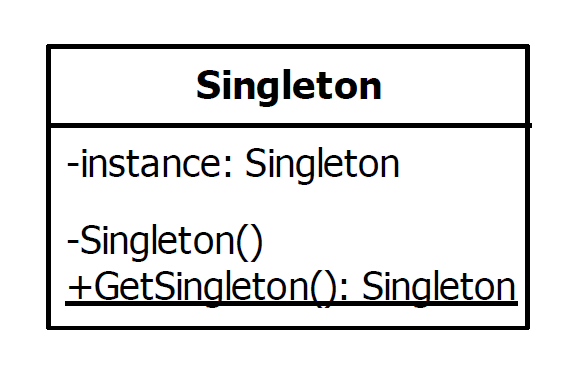

# Singleton Design Pattern

|Name|Type|
|---|---|
|Singleton|Creational|

## Explanation

> The singleton pattern ensures that only one object of a particular class is ever created. All further references to
> objects of the singleton class refer to the same underlying instance.

### Intent

> Ensure a class only has one instance, and provide a global point of access to it.

### Wikipedia

> In software engineering, the singleton pattern is a software design pattern
> that restricts the instantiation of a class to one "single" instance.
> This is useful when exactly one object is needed to coordinate actions across the system.
> The term comes from the mathematical concept of a singleton.

## Implementation

In Kotlin, Types modified by 'object' keyword have only single instance instantiated by kotlin in runtime. To refer to
the object, use its name directly. The initialization of an object is done on first access and 'object' declaration is
thread-safe. Object types cannot have any primary or secondary constructor.



### Example

AppInfo has only one instance and each AppInfo variable refers to it.

```kotlin
object AppInfo {

    init {
        println("AppInfo singleton instance is being initialized")
    }

    val name: String = "Application"
    val version: String = "1.0.0"
    val os: String by lazy {
        println("Looking for OS")
        System.getProperty("os.name")
    }

    fun getAppTitle(): String = "$name: $version"

    fun instanceAddress(): String = Integer.toHexString(this.hashCode())

}
```

Main Function

```kotlin
fun main() {
    println("AppTitle : ${AppInfo.getAppTitle()}")
    println("Singleton instance address: ${AppInfo.instanceAddress()}")
    println("Singleton instance address: ${AppInfo.instanceAddress()}")
    println("OS Name: ${AppInfo.os}")
}
```

Program Output

```
AppInfo singleton instance is being initialized
AppTitle : Application: 1.0.0
Singleton instance address: 783e6358
Singleton instance address: 783e6358
Looking for OS
OS Name: Windows 10
```

## Applicability

Use the Singleton pattern when

* there must be exactly one instance of a class, and it must be accessible to clients from a well-known access point.
* when the sole instance should be extensible by subclassing, and clients should be able to use an extended instance
  without modifying their code.

### Known Uses

- java.lang.Runtime#getRuntime()
- java.lang.System#getSecurityManager()
