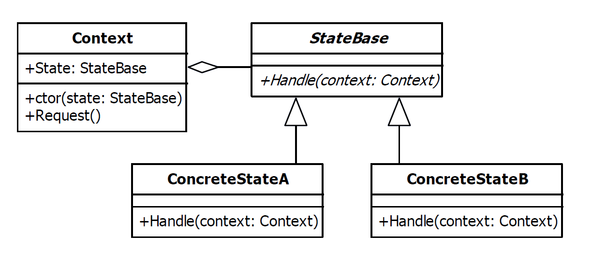

# State Design Pattern

|Name|Type|A.K.A.|
|---|---|---|
|State|Behavioral|<ul><li>Objects for States</li></ul>|

## Explanation

The state pattern is used to alter the behaviour of an object as its internal state changes. The pattern allows the
class for an object to apparently change at run-time.

### Intent

Allow an object to alter its behavior when its internal state changes. The object will appear to change its class.

### Wikipedia

The state pattern is a behavioral software design pattern that allows an object to alter its behavior when its internal
state changes. This pattern is close to the concept of finite-state machines. The state pattern can be interpreted as a
strategy pattern, which is able to switch a strategy through invocations of methods defined in the pattern's interface.

## Implementation



### Example

```kotlin
interface HeroState {
    fun apply(hero: Hero)
    fun onEnterStatus()
}

class FightState : HeroState {
    override fun apply(hero: Hero) {
        hero.health -= 5
    }
    override fun onEnterStatus() {
        println("Hero is fighting")
    }
}

class RestState : HeroState {
    override fun apply(hero: Hero) {
        hero.health += 5;
    }
    override fun onEnterStatus() {
        println("Hero is resting")
    }
}

class WaitState : HeroState {
    override fun apply(hero: Hero) {

    }
    override fun onEnterStatus() {
        println("Hero is waiting")
    }
}
```

```kotlin
class Hero(var health: Int) {

    private var state: HeroState = RestState()

    fun action() {
        state.apply(this)
    }

    fun setState(state: HeroState) {
        this.state = state
        state.onEnterStatus()
    }

    fun printHeroInfo() {
        println("Hero state: ${state.javaClass.simpleName}, health: $health")
    }

}
```

Main Function

```kotlin
fun main() {
    val hero = Hero(100)
    hero.setState(FightState())
    hero.action()
    hero.printHeroInfo()
    hero.setState(RestState())
    hero.action()
    hero.action()
    hero.printHeroInfo()
}
```

Program Output

```
Hero is fighting
Hero state: FightState, health: 95
Hero is resting
Hero state: RestState, health: 105
```

## Applicability

Use the State pattern in either of the following cases

* An object's behavior depends on its state, and it must change its behavior at run-time depending on that state
* Operations have large, multipart conditional statements that depend on the object's state. This state is usually
  represented by one or more enumerated constants. Often, several operations will contain this same conditional
  structure. The State pattern puts each branch of the conditional in a separate class. This lets you treat the object's
  state as an object in its own right that can vary independently from other objects.
