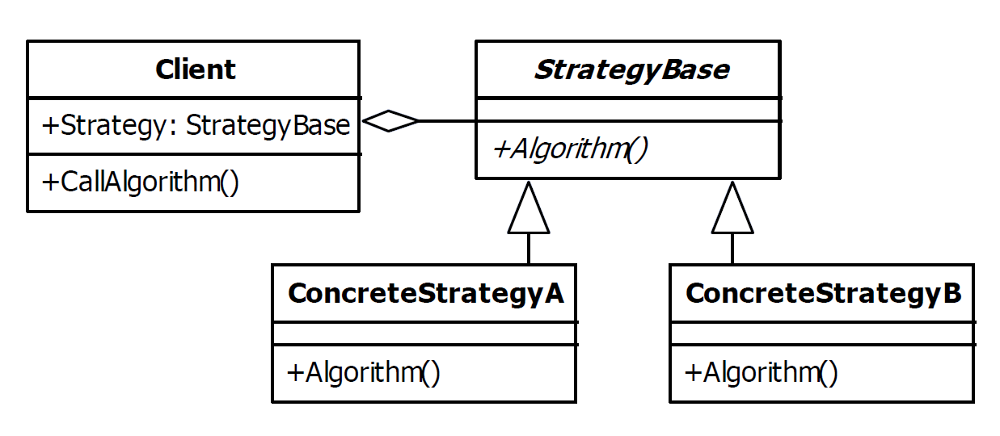

# Strategy Design Pattern

| Name     | Type       | A.K.A.                   |
|----------|------------|--------------------------|
| Strategy | Behavioral | <ul><li>Policy</li></ul> |

## Explanation

> The strategy pattern is used to create an interchangeable family of algorithms from which the required process is chosen at run-time.

### Intent

> Define a family of algorithms, encapsulate each one, and make them interchangeable. Strategy lets the algorithm vary independently from clients that use it.

### Wikipedia

> In computer programming, the strategy pattern (also known as the policy pattern) is a behavioral software design pattern that enables selecting an algorithm at runtime. Instead of implementing a single algorithm directly, code receives run-time instructions as to which in a family of algorithms to use.

## Implementation



### Example

```kotlin
data class Transaction(val username: String, val description: String) {
    val timeMS: Long = System.currentTimeMillis()
}
```

```kotlin
class TransactionLogger(private var strategy: LoggingStrategy, private var dateFormat: DateFormat) {
    fun logTransaction(transaction: Transaction) {
        strategy.log("${dateFormat.format(Date(transaction.timeMS))} - ${transaction.username}: ${transaction.description}")
    }
    fun changeStrategy(strategy: LoggingStrategy) {
        this.strategy = strategy
    }
}
```

```kotlin
sealed interface LoggingStrategy {
    fun log(logMessageStr: String)
}

object ConsoleLoggingStrategy : LoggingStrategy {
    override fun log(logMessageStr: String) {
        println("In Console: $logMessageStr")
    }
}

object FileLoggingStrategy : LoggingStrategy {
    override fun log(logMessageStr: String) {
        println("In File: $logMessageStr")
    }
}

object NoLoggingStrategy : LoggingStrategy {
    override fun log(logMessageStr: String) {
        println("No Logging")
    }
}
```

Main Function

```kotlin
fun main() {
    val transactionLogger = TransactionLogger(ConsoleLoggingStrategy, SimpleDateFormat("yyyy.MM.dd HH:mm"))
    var transaction = Transaction("user1", "sign up")
    transactionLogger.logTransaction(transaction)
    transactionLogger.changeStrategy(FileLoggingStrategy)
    transaction = Transaction("user1", "sign in")
    transactionLogger.logTransaction(transaction)
    transactionLogger.changeStrategy(NoLoggingStrategy)
    transaction = Transaction("user1", "change password")
    transactionLogger.logTransaction(transaction)
}
```

Program Output

```
In Console: 2021.09.17 08:08 - user1: sign up
In File: 2021.09.17 08:08 - user1: sign in
No Logging
```

## Applicability

Use the Strategy pattern when

* many related classes differ only in their behavior. Strategies provide a way to configure a class with one of many
  behaviors.
* you need different variants of an algorithm. For example, you might define algorithms reflecting different space/time
  trade-offs. Strategies can be used when these variants are implemented as a class hierarchy of algorithms.
* an algorithm uses data that clients shouldn't know about. U se the Strategy pattern to avoid exposing complex,
  algorithm-specific data structures.
* a class defines many behaviors, and these appear as multiple conditional statements in its operations. Instead of many
  conditionals, move related conditional branches into their own Strategy class.

### Known Uses

- org.springframework.security.core.context.SecurityContextHolderStrategy
