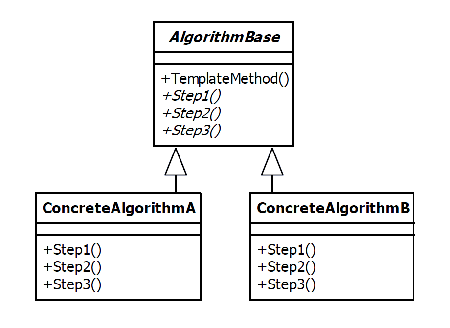

# Template Method Design Pattern

|Name|Type|
|---|---|
|Strategy|Behavioral|

## Explanation

The template method pattern is used to define the basic steps of an algorithm and allow the implementation of the
individual steps to be changed.

### Intent

Define the skeleton of an algorithm in an operation, deferring some steps to subclasses. Template Method lets subclasses
redefine certain steps of an algorithm without changing the algorithm's structure.

### Wikipedia

In object-oriented programming, the template method is one of the behavioral design patterns identified by Gamma et al.
in the book Design Patterns. The template method is a method in a superclass, usually an abstract superclass, and
defines the skeleton of an operation in terms of a number of high-level steps. These steps are themselves implemented by
additional helper methods in the same class as the template method.

## Implementation



### Example

```kotlin
abstract class MessageFormatter {

    fun format(data: ByteArray): String {
        val decodedData = decode(data)
        val str = decodeToString(decodedData)
        return modifyString(str)
    }

    abstract fun decode(data: ByteArray): ByteArray

    abstract fun decodeToString(data: ByteArray): String

    abstract fun modifyString(str: String): String

}
```

```kotlin
class SimpleMessageFormatter : MessageFormatter() {

    override fun decode(data: ByteArray): ByteArray = data

    override fun decodeToString(data: ByteArray): String = String(data, Charset.forName("UTF-8"))

    override fun modifyString(str: String): String = "Message: ($str)"

}
```

```kotlin
class EncodedMessageFormatter : MessageFormatter() {

    val decoder = Base64.getDecoder()

    override fun decode(data: ByteArray): ByteArray = decoder.decode(data)

    override fun decodeToString(data: ByteArray): String = String(data, Charset.forName("UTF-8"))

    override fun modifyString(str: String): String = "Message: [$str]"

}
```

Main Function

```kotlin
fun main() {
    val message = "La tristesse durera toujours"
    val base64EncodedMessage = "TGEgdHJpc3Rlc3NlIGR1cmVyYSB0b3Vqb3Vycw=="
    val simpleMessageFormatter: MessageFormatter = SimpleMessageFormatter()
    var formattedMessageStr = simpleMessageFormatter.format(message.encodeToByteArray())
    println(formattedMessageStr)
    val encodedMessageFormatter: MessageFormatter = EncodedMessageFormatter()
    formattedMessageStr = encodedMessageFormatter.format(base64EncodedMessage.encodeToByteArray())
    println(formattedMessageStr)
}
```

Program Output

```
Message: (La tristesse durera toujours)
Message: [La tristesse durera toujours]
```

## Applicability

The Template Method pattern should be used

* To implement the invariant parts of an algorithm once and leave it up to subclasses to implement the behavior that can
  vary
* When common behavior among subclasses should be factored and localized in a common class to avoid code duplication.
  This is a good example of "refactoring to generalize" as described by Opdyke and Johnson. You first identify the
  differences in the existing code and then separate the differences into new operations. Finally, you replace the
  differing code with a template method that calls one of these new operations
* To control subclasses extensions. You can define a template method that calls "hook" operations at specific points,
  thereby permitting extensions only at those points
